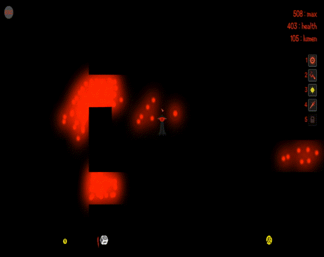

### Boid Project
Made in Unity and finished September 2020

**Boid Algorithm:** The boid algorithm is really pretty looking simulation of a flock of birds or school of fish.
My algorithm impleaments the standard seperation, cohesion and alignment methods.
I also added a wall avoidance method using raycasts.

**Spatial Partitioning System**
(at least I think its a spatial partitioning system)
My system contains a grid class with a 2d array of a class called cells 
and a doubly linked list of cells that contain boids. The cell classes themselves contain a doubly linked list of boids positioned in the cell,
the sum position and direction of said list of boids and a list of cells within a perception range.
The system greatly helps with reducing calulation times, but increases overhead costs.

**UI**
I put it together kind of quick so it doesn't look too good but it has some nice features in it.

Demo of the project [here](https://parkerallen.github.io/BoidProject/){:target="_blank" rel="noopener"}

